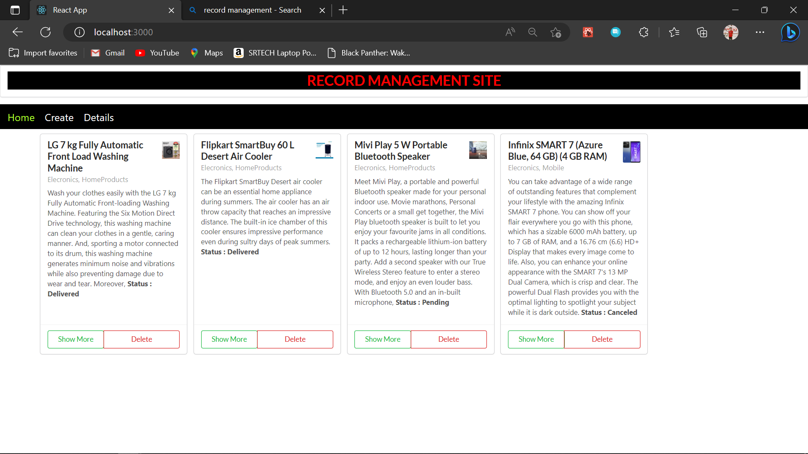
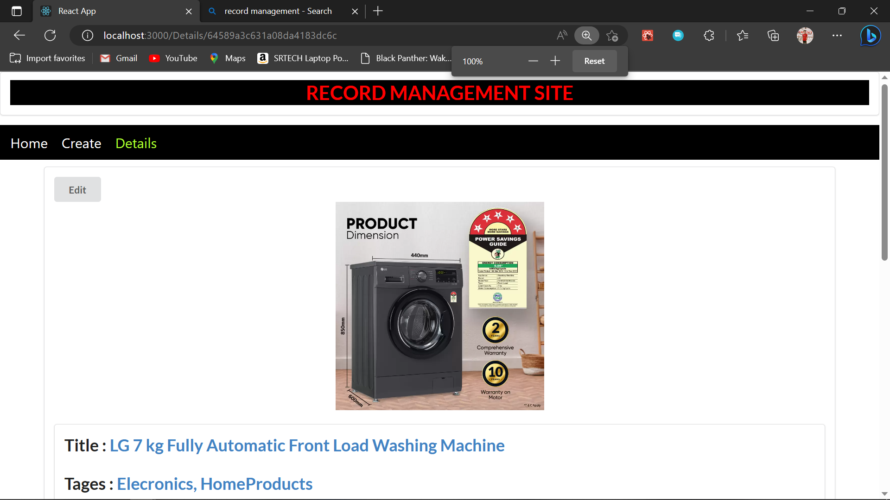
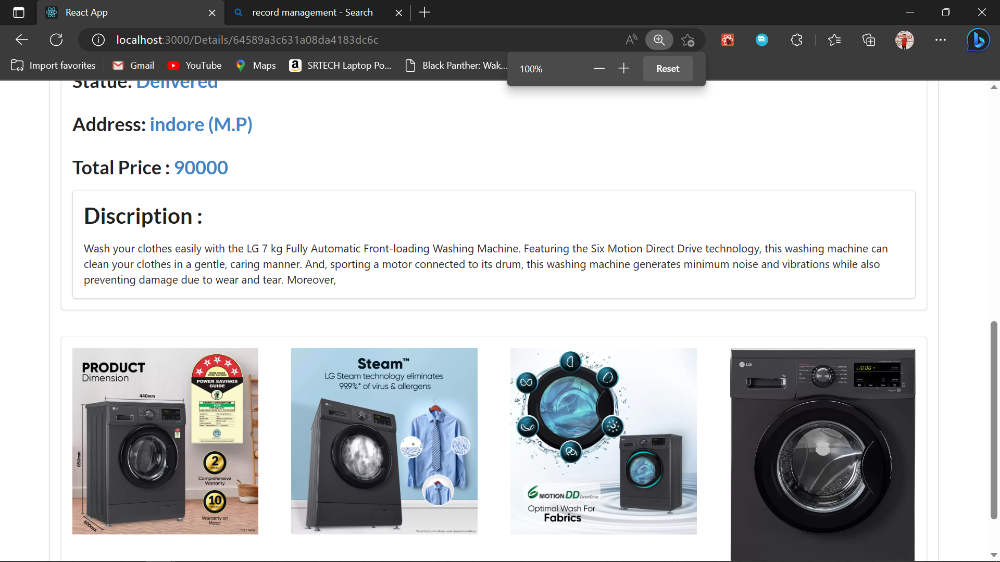
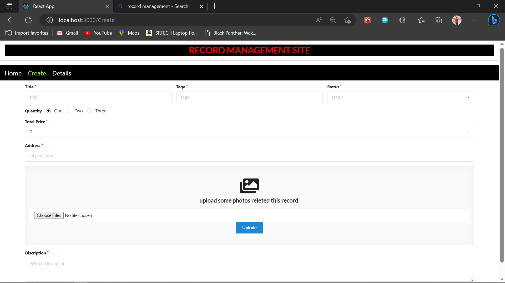
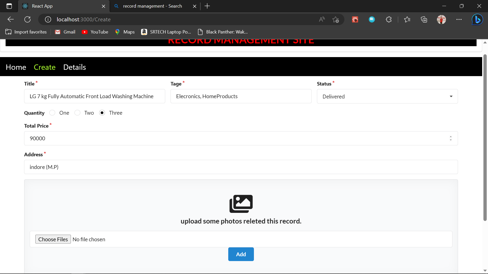
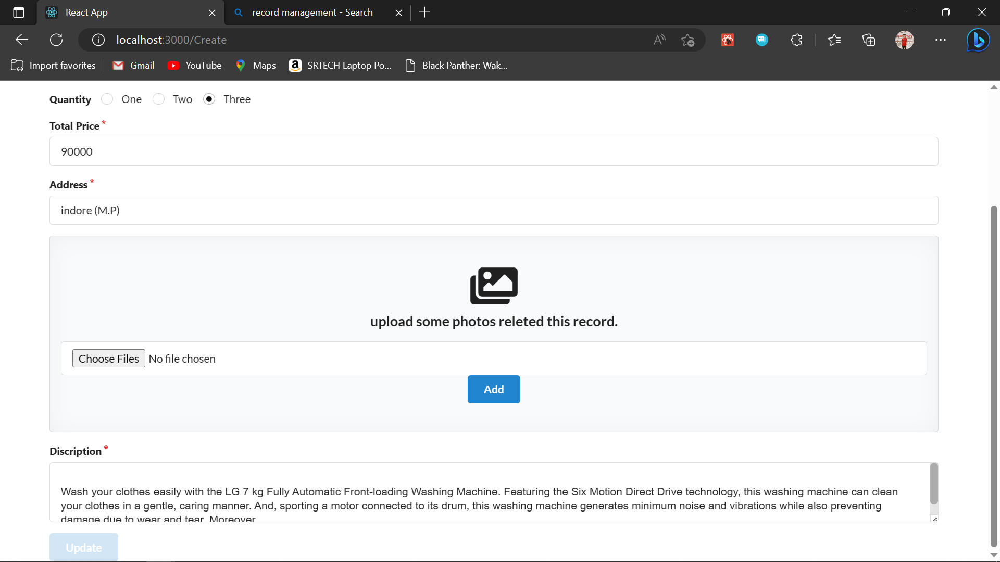

# NYX_Assignment

## Overview
Record Managment website is an online Record site which is use for store some record data.
You can sotre many records for long time.
and managing that records acording to your requirments.

## Installation and Setup
1. Clone the repository to your local machine.
2. Run npm install to install the dependencies.
3. Run npm start to start the app.

## Usage
1. Navigate to the Home page using the navbar.
2. All records list represent in Home page.
3. Click to create Button.
4. navigate to Create Page and put all information releted to record.
5. Add some Images and Click Upload Button first.
6. Click Submit Button to create Records.

## Technologies Used
1. MongoDB: a NoSQL database used for storing and retrieving data
2. Express.js: a web application framework for Node.js
3. React: a JavaScript library for building user interfaces
4. Node.js: a JavaScript runtime environment for running server-side code
5. Sementic ui react: a CSS framework for building responsive web pages
6. AWS S3: a Amazon Simple Storage Service for storing user profile photo and product cover photos

## About

## Screenshots
The following screenshots provide a visual representation of the app:

###### Home Page

 
 
 

###### Record Details Page

 
 
 

###### Record Details Page

 
 
 

###### Create page

 
 
 

###### Update Page

 
 
 

###### Record Update Page

 
 
 

###### Record Delete Page

 
 
 

## Credits
This project uses several open-source libraries and tools:

1. React
2. Node.js
3. Express.js
4. Sementic UI
5. AWS S3
